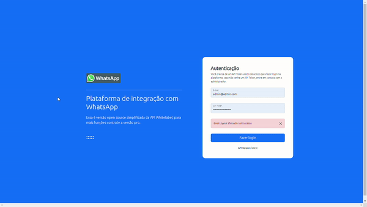

# MyZap Oficial®️
<p>
  

  <a href="https://github.com/billbarsch/myzap/commits/master">
    
  </a>
      
   <a href="https://github.com/billbarsch/myzap/stargazers">
    
  </a>

  <a href="https://github.com/billbarsch/myzap/network">
    
  </a>

  

  

  
</p>

## Sobre
MyZap®️ é uma API REST FULL 100% Gratuita e Open Source

Este projeto usa como base o [WPPCONNECT](https://github.com/wppconnect-team/wppconnect), e [Whatsapp-WEB.JS](https://github.com/pedroslopez/whatsapp-web.js/), e [Venom-bot](https://github.com/orkestral/venom) um navegador virtual sem interface gráfica que abre o whatsapp web e executa todos os comandos via código possibilitando assim a automação de todas as funções.

## Como rodar a versão 3.0

#### Instalando Dependências

```bash
apt update && apt upgrade && cd /opt && apt install -y curl nano git net-tools htop gconf-service libasound2 libatk1.0-0 libc6 libcairo2 libcups2 libdbus-1-3 libexpat1 libfontconfig1 libgcc1 libgconf-2-4 libgdk-pixbuf2.0-0 libglib2.0-0 libgtk-3-0 libnspr4 libpango-1.0-0 libpangocairo-1.0-0 libstdc++6 libx11-6 libx11-xcb1 libxcb1 libxcomposite1 libxcursor1 libxdamage1 libxext6 libxfixes3 libxi6 libxrandr2 libxrender1 libxss1 libxtst6 ca-certificates fonts-liberation libappindicator1 libnss3 lsb-release xdg-utils wget build-essential apt-transport-https libgbm-dev nginx python3-certbot-nginx
```

#### Instalando Node 20
```bash
curl https://raw.githubusercontent.com/creationix/nvm/master/install.sh | bash  && source ~/.profile  && nvm install 20 && nvm use 20
```

#### Instalando o chrome
```bash
cd /opt/api-whatsapp/ && sudo apt install gdebi -y
wget https://dl.google.com/linux/direct/google-chrome-stable_current_amd64.deb && sudo gdebi google-chrome*

google-chrome --version
```

#### Instale a API no diretorio
```bash
npm i && npm audit fix --force
```

#### Rodar database
```bash
bash ./scripts/database.sh
```
   
### Default user
email: ```admin@admin.com```
password: ```your_token_api```

#### Rodar API com PM2
```bash
bash ./scripts/start.sh
```

## Desenvolvedores e Suporte
- +55 (63) 99215-8117 - [BillBarsch](https://github.com/billbarsch) (Desenvolvedor Oficial)
- +55 (43) 99661-1437 - [Eduardo Policarpo](https://github.com/edupoli) (Desenvolvedor 2.0)
- +55 (31) 99435-9434 - [Jonathan Henrique](https://github.com/jhowbhz) (Desenvolvedor 3.0)

#### Para suporte direto com o desenvolver da API chame no WhatsApp
<a target="_blank" href="https://api.whatsapp.com/send?phone=5531994359434&text=Gostaria%20de%20mais%20informa%C3%A7%C3%B5es%20sobre%20o%20suporte%20da%20API%20MyZAP3.0" target="_blank"></a>

## Grupos de Apoio
<a href="https://chat.whatsapp.com/EeAWALQb6Ga5oeTbG7DD2k">
     
</a>

<a href="https://chat.whatsapp.com/IDqZrBmBIYL50Mq63NfraA">
     
</a>

<a href="https://chat.whatsapp.com/CTVp994clKsKunqzczFfu7">
     
</a>

<a href="https://chat.whatsapp.com/Eg7D1Yd4RIQ07GkTyMKnxd">
     
</a>

<a href="https://t.me/joinchat/tOiGjpK_0xg4OGZh">
    
</a>

## Prints da interface


Click para visualizar:
https://www.youtube.com/watch?v=iRMk-qOZY2Q

## Cliente PHP

https://myzap.apibrasil.com.br

#### Download do Pacote
```bash
composer require jhowbhz/package-apigratis
```

## Cadê a versão completa profissional?
👉 Deseja obter a versão profissional com suporte, auto instalador, update automático, mais de 72 as funções e um pão de queijo? Acesse: https://whitelabel.apibrasil.com.br

## Atividades Recentes
[](https://repography.com)

[](https://github.com/billbarsch/myzap/pulls)

[](https://github.com/billbarsch/myzap/commits)

## Top contributors
[](https://github.com/billbarsch/myzap/graphs/contributors)
